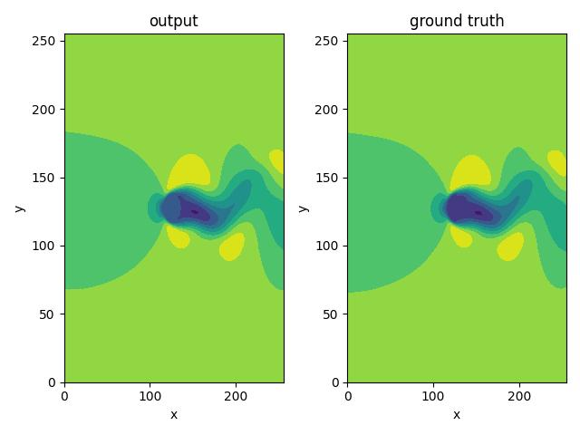
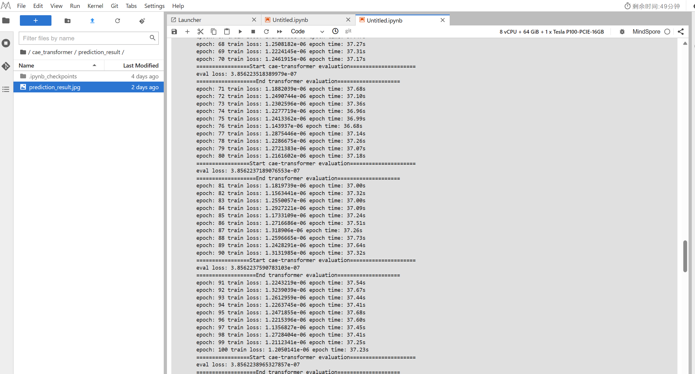

# 1. 论文介绍

## 1.1 背景介绍

计算机技术的高速发展极大地推动了计算流体力学(computational fluid dynamics, CFD)，传统 CFD 方法对实际复杂流动问题开展高精度数值模拟需要耗费大量的计算资源。

为了解决CFD数值模拟计算精度和效率较难兼顾的问题，构造流场降阶模型 (reduced-ordermodel,ROM) 的方法得到研究，ROM具有接近CFD数值模拟的精度，但计算效率相比CFD至少可以提升 2~3 个数量级，有效节约了计算成本，构造流场ROM主要有2类方法，嵌入式与非嵌入式，非
嵌入式ROM会在模态分解的基础上进一步构造代码模型，现阶段，非嵌入式 ROM 的系数时间演化主要应用的方法有DMD方法和人工神经网络(artificial neural network, ANN)方法，由此神经网络也
逐步在流体力学研究中逐步应用。

## 1.2 论文方法

本文的方法主要来自于三篇论文：

1.《CAE-TRANSFORMER: TRANSFORMER-BASED MODEL TO PREDICT INVASIVENESS OF LUNG ADENOCARCINOMA SUBSOLID NODULES FROM NON-THIN SECTION 3D CT SCANS》

2.《Informer: Beyond Efficient Transformer for Long Sequence Time-Series Forecasting》

3.《卷积自编码器在非定常可压缩流动降阶模型中的适用性》

论文一首先以CT影响的肺癌预测为目的，引入了CAE-Transformer模型，即将训练好的CAE和tranformer模型结合进行级联预测肺癌的分类结果；

论文二提出了一个用于时间序列预测的transformer结构模型Informer；

论文三，利用类似CAE-Transformer的模型结构，使用CAE对流体数据进行降维，中间级联LSTM进行流场的时序预测，后级联CAE的decoder进行还原。

而本方法结合三篇论文的方法：采用了CAE进行流场数据的降阶和重构，中间级联效果更好的informer进行时序预测。

## 1.3 数据集介绍

来源：二维圆柱绕流数值仿真流场数据，由北京航空航天大学航空科学与工程学院于剑副教授团队提供。

数据说明：
数据集针对10个雷诺数的圆柱绕流进行了数值模拟，每个雷诺数下的流场数据包含401个时间步，每个时间步的流场数据为256*256的二维流场，每个变量的数据类型为float32，数据集总大小为约1.96GB。

数据集下载链接:
[2D_cylinder_flow.npy](https://download.mindspore.cn/mindscience/mindflow/dataset/applications/data_driven/cae-transformer/2D_cylinder_flow.npy)

## 1.4 pipeline

本作业将基于mindscience[官方代码仓库](https://gitee.com/mindspore/mindscience)实现，


# 2. pytorch实现版本

## 2.1 论文一代码 CAE-Transformer

下载代码包：

```
git clone https://github.com/ShahinSHH/CAE-Transformer.git
```

安装依赖包：

```
python 3.7
PyTorch 1.4.0
Torch 1.5.1
PyDicom 1.4.2
SimpleITK
lungmask
pylidc
OpenCV
Scikit-learn
Pandas
OS
Numpy
Matplotlib
Citation
```

由于论文一使用该模型所做的任务为分类任务，数据完全不同，所以只参考其模型代码

## 2.2 论文二代码 Informer

下载代码包:

```
git clone https://github.com/zhouhaoyi/Informer2020.git
```

安装依赖包:

```
matplotlib == 3.1.1
numpy == 1.19.4
pandas == 0.25.1
scikit_learn == 0.21.3
torch == 1.8.0
```

参考的informer模型代码

```python
class Informer(nn.Module):
    def __init__(self, enc_in, dec_in, c_out, seq_len, label_len, out_len, 
                factor=5, d_model=512, n_heads=8, e_layers=3, d_layers=2, d_ff=512, 
                dropout=0.0, attn='prob', embed='fixed', freq='h', activation='gelu', 
                output_attention = False, distil=True, mix=True,
                device=torch.device('cuda:0')):
        super(Informer, self).__init__()
        self.pred_len = out_len
        self.attn = attn
        self.output_attention = output_attention

        # Encoding
        self.enc_embedding = DataEmbedding(enc_in, d_model, embed, freq, dropout)
        self.dec_embedding = DataEmbedding(dec_in, d_model, embed, freq, dropout)
        # Attention
        Attn = ProbAttention if attn=='prob' else FullAttention
        # Encoder
        self.encoder = Encoder(
            [
                EncoderLayer(
                    AttentionLayer(Attn(False, factor, attention_dropout=dropout, output_attention=output_attention), 
                                d_model, n_heads, mix=False),
                    d_model,
                    d_ff,
                    dropout=dropout,
                    activation=activation
                ) for l in range(e_layers)
            ],
            [
                ConvLayer(
                    d_model
                ) for l in range(e_layers-1)
            ] if distil else None,
            norm_layer=torch.nn.LayerNorm(d_model)
        )
        # Decoder
        self.decoder = Decoder(
            [
                DecoderLayer(
                    AttentionLayer(Attn(True, factor, attention_dropout=dropout, output_attention=False), 
                                d_model, n_heads, mix=mix),
                    AttentionLayer(FullAttention(False, factor, attention_dropout=dropout, output_attention=False), 
                                d_model, n_heads, mix=False),
                    d_model,
                    d_ff,
                    dropout=dropout,
                    activation=activation,
                )
                for l in range(d_layers)
            ],
            norm_layer=torch.nn.LayerNorm(d_model)
        )
        # self.end_conv1 = nn.Conv1d(in_channels=label_len+out_len, out_channels=out_len, kernel_size=1, bias=True)
        # self.end_conv2 = nn.Conv1d(in_channels=d_model, out_channels=c_out, kernel_size=1, bias=True)
        self.projection = nn.Linear(d_model, c_out, bias=True)
        
    def forward(self, x_enc, x_mark_enc, x_dec, x_mark_dec, 
                enc_self_mask=None, dec_self_mask=None, dec_enc_mask=None):
        enc_out = self.enc_embedding(x_enc, x_mark_enc)
        enc_out, attns = self.encoder(enc_out, attn_mask=enc_self_mask)

        dec_out = self.dec_embedding(x_dec, x_mark_dec)
        dec_out = self.decoder(dec_out, enc_out, x_mask=dec_self_mask, cross_mask=dec_enc_mask)
        dec_out = self.projection(dec_out)
        
        # dec_out = self.end_conv1(dec_out)
        # dec_out = self.end_conv2(dec_out.transpose(2,1)).transpose(1,2)
        if self.output_attention:
            return dec_out[:,-self.pred_len:,:], attns
        else:
            return dec_out[:,-self.pred_len:,:] # [B, L, D]
```
# 3. mindspore实现版本

参考： https://gitee.com/mindspore/mindscience

代码仓库：https://github.com/xuxubaob/CAE-Transformer_mindspore

## 3.1 mindspore框架介绍

MindSpore是华为推出的一款人工智能计算框架，主要用于开发AI应用和模型。它的特点如下:

- 框架设计：MindSpore采用静态计算图设计，PyTorch采用动态计算图设计。静态计算图在模型编译时确定计算过程，动态计算图在运行时确定计算过程。静态计算图通常更高效，动态计算图更灵活；
- 设备支持：MindSpore在云端和边缘端都有较好的支持，可以在Ascend、CPU、GPU等硬件上运行；
- 自动微分：MindSpore提供自动微分功能，可以自动求导数，简化模型训练过程；
- 运算符和层：MindSpore提供丰富的神经网络层和运算符，覆盖CNN、RNN、GAN等多种模型；
- 训练和部署：MindSpore提供方便的模型训练和部署功能，支持ONNX、CANN和MindSpore格式的模型导出，可以部署到Ascend、GPU、CPU等硬件；


## 3.2 环境准备

我们使用华为modelarts，Notebook开发环境。

选择华北-北京四区，创建环境镜像MindSpore_2.0.0-Cuda_11.6-py_3.9-Ubuntu_20.04

```
swr.cn-north-4.myhuaweicloud.com/atelier/mindspore_2_0:mindspore_2.0.0-cuda_11.6-py_3.9-ubuntu_20.04-x86_64-20230822144810-5af8ecb
```

将镜像导入到Notebook开发环境后，选择使用gpu，克隆mindspore版本cae-transformer代码

```
git clone https://github.com/xuxubaob/CAE-Transformer_mindspore.git
```

由于Notebook环境中,已经有我们需要的mindspore依赖，所以不需要额外安装包

## 3.3 模型迁移

将Pytorch的API替换成mindspore的API，官方给出了[文档说明](https://www.mindspore.cn/docs/zh-CN/r1.7/note/api_mapping/pytorch_api_mapping.html)。

另外mindspore还提供了[MindConverter](https://www.mindspore.cn/mindinsight/docs/zh-CN/r1.7/migrate_3rd_scripts_mindconverter.html)工具，方便从pytorch迁移模型。

下面是我在模型迁移过程替换的API以及Class：

| pytorch API / Class       | mindspore API/Class                | 说明                          | 两者差异                                                     |
| ------------------------- | ---------------------------------- | ----------------------------- | ------------------------------------------------------------ |
| torch.from_numpy          | mindspore.tensor.from_numpy        | 从numpy得到tensor             | 无                                                           |
| torch.tensor.to           | mindspore.tensor.to_device         | 将tensor传入指定的设备        | 无                                                           |
| torch.utils.data.Dataset  | mindspore.dataset.GeneratorDataset | 数据集类                      | PyTorch：自定义数据集的抽象类，自定义数据子类可以通过调用`__len__()`和`__getitem__()`这两个方法继承这个抽象类。<br />MindSpore：通过每次调用Python层自定义的Dataset以生成数据集。 |
| torch.zeros_like          | mindspore.ops.ZerosLike            | 获得指定shape的全零元素tensor | 无                                                           |
| torch.nn.Sigmoid          | mindspore.nn.Sigmoid               | 激活函数                      | 无                                                           |
| torch.nn.Tanh             | mindspore.nn.Tanh                  | 激活函数                      | 无                                                           |
| torch.nn.ReLU             | mindspore.nn.ReLU                  | 激活函数                      | 无                                                           |
| torch.nn.Softmax          | mindspore.nn.Softmax               | 归一化                        | 无                                                           |
| torch.nn.LeakyReLU        | mindspore.nn.LeakyReLU             | 激活函数                      | 无                                                           |
| torch.nn.Sequential       | mindspore.nn.SequentialCell        | 整合多个网络模块              | 无                                                           |
| torch.argmax              | mindspore.ops.argmax               | 返回最大值下标                | PyTorch：沿着给定的维度返回Tensor最大值所在的下标，返回值类型为torch.int64。<br />MindSpore：MindSpore此API实现功能与PyTorch基本一致，返回值类型为int32. |
| torch.abs                 | mindspore.ops.abs                  | 计算tensor绝对值              | PyTorch：计算输入的绝对值。<br />MindSpore：MindSpore此API实现功能与PyTorch一致，仅参数名不同。 |
| torch.mean                | mindspore.ops.ReduceMean           | 计算均值                      | 无                                                           |
| torch.optim.Adam          | mindspore.nn.Adam                  | 优化器                        | 无                                                           |
| torch.nn.CrossEntropyLoss | mindspore.nn.CrossEntropyLoss      | 损失函数                      | PyTorch：计算预测值和目标值之间的交叉熵损失。<br />MindSpore：MindSpore此API实现功能与PyTorch基本一致，而且目标值支持两种不同的数据形式：标量和概率。 |
| torch.nn.Module           | mindspore.nn.Cell                  | 神经网络的基本构成单位        |                                                              |
| torch.nn.Linear           | mindspore.nn.Dense                 | 全连接层                      | PyTorch：全连接层，实现矩阵相乘的运算。<br />MindSpore：MindSpore此API实现功能与PyTorch基本一致，而且可以在全连接层后添加激活函数。 |
| torch.cat                 | mindspore.ops.concat               | tensor按照指定维度拼接        | 无                                                           |
| torch.randn               | mindspore.ops.StandardNormal       | 获得正态分布数据的tensor      | 无                                                           |
| torch.mm                  | mindspore.ops.MatMul               | 矩阵乘法                      | 无                                                           |
| torch.sqrt                | mindspore.ops.Sqrt                 | 开根号                        | 无                                                           |
| torch.sum                 | mindspore.ops.ReduceSum            | 求和                          | 无                                                           |
| torch.Tensor.mul          | mindspore.ops.Mul                  | 相乘                          | 无                                                           |
| torch.div                 | mindspore.ops.div                  | 除法                          | 无                                                           |
| torch.nn.Embedding        | mindspore.nn.Embedding             |                               | PyTorch：支持使用`_weight`属性初始化embedding，并且可以通过`weight`变量获取当前embedding的权重。<br />MindSpore：支持使用`embedding_table`属性初始化embedding，并且可以通过`embedding_table`属性获取当前embedding的权重。除此之外，当`use_one_hot`为True时，你可以得到具有one-hot特征的embedding。 |
| torch.tensor.repeat       | mindspore.ops.tile                 | 对tensor进行重复叠加          | 无                                                           |
| torch.tensor.view         | mindspore.ops.Reshape              | 重新排列tensor的维度          | 无                                                           |
| Adam.zero_grad            | Adam.clear_grad                    | 清除梯度                      | 无                                                           |
|                           |                                    |                               |                                                              |


## 3.4 训练与推理

下载链接中的数据集[2D_cylinder_flow.npy](https://download.mindspore.cn/mindscience/mindflow/dataset/applications/data_driven/cae-transformer/2D_cylinder_flow.npy)
放在`./dataset/`文件夹中

修改config中的参数，执行train.py进行训练

`python -u train.py --mode GRAPH --device_target GPU --device_id 0 --config_file_path ./config.yaml`

执行eval.py进行模型推理和可视化

`python -u eval.py`

## 3.5 详细代码

### 数据集实现

```python
class CAETransformerDataset:
    """convert raw data into train dataset"""

    def __init__(self, data, seq_len, pred_len):
        self.time_size = data.shape[0] - seq_len - pred_len
        self.full_time_size = data.shape[0]
        self.raynold = data.shape[1]
        self.input_dim = data.shape[-1]
        self.seq_len = seq_len
        self.pred_len = pred_len
        self.data = np.reshape(data, (-1, 1, self.input_dim, self.input_dim))

    def __getitem__(self, index):
        time_index = index % self.time_size
        raynold_index = (index // self.time_size) * self.full_time_size
        return self.data[raynold_index+time_index:raynold_index+time_index+self.seq_len], \
               self.data[raynold_index+time_index+self.seq_len:raynold_index+time_index+self.seq_len+self.pred_len]

    def __len__(self):
        return self.time_size * self.raynold


def create_caetransformer_dataset(data_path, batch_size, seq_len, pred_len, train_ratio=0.8):
    """create Transformer dataset"""
    true_data = np.load(data_path)
    train_split = int(true_data.shape[1] * train_ratio)
    train_data = true_data[:, :train_split]
    eval_data = true_data[:, train_split:]

    data = np.expand_dims(train_data, 2).astype(np.float32)
    dataset_generator = CAETransformerDataset(data, seq_len, pred_len)
    dataset = ms.dataset.GeneratorDataset(
        dataset_generator, ["data", "label"], shuffle=True
    )
    dataset = dataset.batch(batch_size, drop_remainder=True)
    return dataset, eval_data
```


### 网络实现

```python
class CaeInformer(nn.Cell):
    """Cae-Transformer flow field prediction model"""
    def __init__(self, enc_in, dec_in, c_out, pred_len, label_len,
                 data_dimension, conv_kernel, maxpool_kernel, maxpool_stride,
                 channels_encoder, channels_decoder, channels_dense,
                 d_model=128, n_heads=2, e_layers=1, d_layers=1, d_ff=256, attn='full'):
        """
        Args:
        enc_in: int, input dimension of encoder
        dec_in: int, input dimension of decoder
        c_out: int, output dimension of decoder
        pred_len: int, length of prediction
        label_len: int, length of label sequence of decoder
        data_dimension: int, dimension of input data
        conv_kernel: list, kernel size of convolution layer
        maxpool_kernel: list, kernel size of maxpooling layer
        maxpool_stride: list, stride of maxpooling layer
        """
        super(CaeInformer, self).__init__()
        self.pred_len = pred_len
        self.label_len = label_len
        self.attn = attn
        self.reshape = ops.Reshape()

        # Encoding
        self.enc_embedding = DataEmbedding(enc_in, d_model, 'fixed', 'h', 0.1)
        self.dec_embedding = DataEmbedding(dec_in, d_model, 'fixed', 'h', 0.1)
        # Attention
        attn = ProbAttention if attn == 'prob' else FullAttention
        # Encoder
        self.encoder = Encoder(
            [
                EncoderLayer(
                    AttentionLayer(attn(False, 5, attention_dropout=0.1,
                                        output_attention=False, args=None),
                                   d_model, n_heads, mix=False),
                    d_model,
                    d_ff,
                    dropout=0.1,
                    activation='gelu'
                ) for _ in range(e_layers)
            ],
            [
                ConvLayer(
                    d_model
                ) for _ in range(e_layers-1)
            ],
            norm_layer=nn.LayerNorm([d_model])
        )
        # Decoder
        self.decoder = Decoder(
            [
                DecoderLayer(
                    AttentionLayer(attn(True, 5, attention_dropout=0.1, output_attention=False,
                                        args=None, d_value=d_model/n_heads),
                                   d_model, n_heads, mix=False),
                    AttentionLayer(FullAttention(False, 5, attention_dropout=0.1, output_attention=False),
                                   d_model, n_heads, mix=False),
                    d_model,
                    d_ff,
                    dropout=0.1,
                    activation='gelu',
                )
                for l in range(d_layers)
            ],
            norm_layer=nn.LayerNorm([d_model])
        )
        self.projection = nn.Dense(d_model, c_out, has_bias=True)
        # CAE
        self.cae_encoder = CaeEncoder(conv_kernel, maxpool_kernel, maxpool_stride, channels_encoder, channels_dense)
        self.cae_decoder = CaeDecoder(data_dimension, conv_kernel, channels_decoder, channels_dense)

    def construct(self, x,
                  enc_self_mask=None, dec_self_mask=None, dec_enc_mask=None):
        """predict flow field based on input data"""
        cast = ops.Cast()
        batch_size = ops.shape(x)[0]
        seq_len = ops.shape(x)[1]
        x0 = x[:, -1]
        x = self.reshape(x, (-1, 1, 256, 256))

        # CAE Encoder
        x_enc = self.cae_encoder(x)
        x_enc = self.reshape(x_enc, (batch_size, seq_len, -1))
        latent_size = ops.shape(x_enc)[-1]
        # print(x_enc)

        # Transformer Encoder
        enc_inp = self.enc_embedding(x_enc)
        enc_out = self.encoder(enc_inp, attn_mask=enc_self_mask)

        # Transformer Decoder
        dec_inp = ops.Zeros()(
            (batch_size, self.pred_len, x_enc.shape[-1]), ms.float32
        )
        dec_inp = cast(
            ops.concat([x_enc[:, - self.label_len :, :], dec_inp], axis=1),
            ms.float32,
        )
        dec_inp = self.dec_embedding(dec_inp)
        dec_out = self.decoder(dec_inp, enc_out, x_mask=dec_self_mask, cross_mask=dec_enc_mask)
        dec_out = self.projection(dec_out)[:, -self.pred_len:, :]

        # CAE Decoder
        dec_out = self.reshape(dec_out, (-1, 1, latent_size))
        cae_out = self.cae_decoder(dec_out)
        cae_out = self.reshape(cae_out, (batch_size, self.pred_len, 256, 256)) + x0

        return cae_out
```

## 3.6 训练结果

下面是mindspore模型的训练100个epoch的输出结果：

```
epoch: 1 train loss: 1.7219155 epoch time: 51.76s
epoch: 2 train loss: 1.3866308 epoch time: 37.75s
epoch: 3 train loss: 1.1098311 epoch time: 37.86s
epoch: 4 train loss: 0.88271916 epoch time: 37.58s
epoch: 5 train loss: 0.69746256 epoch time: 37.37s
epoch: 6 train loss: 0.547276 epoch time: 37.09s
epoch: 7 train loss: 0.42631188 epoch time: 37.06s
epoch: 8 train loss: 0.32955232 epoch time: 37.15s
epoch: 9 train loss: 0.25271344 epoch time: 37.22s
epoch: 10 train loss: 0.19216011 epoch time: 37.14s
=================Start cae-transformer evaluation=====================
eval loss: 0.1916087839011155
===================End transformer evaluation====================
epoch: 11 train loss: 0.14482507 epoch time: 37.13s
epoch: 12 train loss: 0.108136974 epoch time: 37.07s
epoch: 13 train loss: 0.079955816 epoch time: 37.11s
epoch: 14 train loss: 0.058512993 epoch time: 37.05s
epoch: 15 train loss: 0.042360157 epoch time: 37.08s
epoch: 16 train loss: 0.030319676 epoch time: 37.00s
epoch: 17 train loss: 0.021443903 epoch time: 37.17s
epoch: 18 train loss: 0.014977281 epoch time: 37.20s
epoch: 19 train loss: 0.0103236325 epoch time: 37.09s
epoch: 20 train loss: 0.0070179873 epoch time: 37.05s
=================Start cae-transformer evaluation=====================
eval loss: 0.006988783228283108
===================End transformer evaluation====================
epoch: 21 train loss: 0.004701856 epoch time: 37.13s
epoch: 22 train loss: 0.0031023435 epoch time: 37.11s
epoch: 23 train loss: 0.0020143413 epoch time: 37.11s
epoch: 24 train loss: 0.0012862205 epoch time: 37.09s
epoch: 25 train loss: 0.00080681185 epoch time: 37.10s
epoch: 26 train loss: 0.00049698877 epoch time: 37.08s
epoch: 27 train loss: 0.00030026957 epoch time: 37.10s
epoch: 28 train loss: 0.00017792564 epoch time: 37.10s
epoch: 29 train loss: 0.00010341784 epoch time: 37.20s
epoch: 30 train loss: 5.8878675e-05 epoch time: 37.23s
=================Start cae-transformer evaluation=====================
eval loss: 5.7774542785181485e-05
===================End transformer evaluation====================
epoch: 31 train loss: 3.3027623e-05 epoch time: 37.11s
epoch: 32 train loss: 1.8311066e-05 epoch time: 37.07s
epoch: 33 train loss: 1.0090976e-05 epoch time: 37.15s
epoch: 34 train loss: 5.735135e-06 epoch time: 37.33s
epoch: 35 train loss: 3.5105722e-06 epoch time: 37.05s
epoch: 36 train loss: 2.2996705e-06 epoch time: 37.10s
epoch: 37 train loss: 1.7041889e-06 epoch time: 37.30s
epoch: 38 train loss: 1.487402e-06 epoch time: 37.10s
epoch: 39 train loss: 1.3263783e-06 epoch time: 37.34s
epoch: 40 train loss: 1.2773153e-06 epoch time: 37.50s
=================Start cae-transformer evaluation=====================
eval loss: 4.2537590004675735e-07
===================End transformer evaluation====================
epoch: 41 train loss: 1.2567489e-06 epoch time: 37.24s
epoch: 42 train loss: 1.230682e-06 epoch time: 37.31s
epoch: 43 train loss: 1.2039268e-06 epoch time: 36.95s
epoch: 44 train loss: 1.2417636e-06 epoch time: 36.96s
epoch: 45 train loss: 1.1772336e-06 epoch time: 36.85s
epoch: 46 train loss: 1.0941167e-06 epoch time: 37.14s
epoch: 47 train loss: 1.1700762e-06 epoch time: 37.18s
epoch: 48 train loss: 1.2084357e-06 epoch time: 37.09s
epoch: 49 train loss: 1.2024001e-06 epoch time: 37.55s
epoch: 50 train loss: 1.2133094e-06 epoch time: 37.90s
=================Start cae-transformer evaluation=====================
eval loss: 3.856228002691235e-07
===================End transformer evaluation====================
epoch: 51 train loss: 1.2303012e-06 epoch time: 37.24s
epoch: 52 train loss: 1.2277984e-06 epoch time: 37.84s
epoch: 53 train loss: 1.2603829e-06 epoch time: 37.62s
epoch: 54 train loss: 1.3200272e-06 epoch time: 37.08s
epoch: 55 train loss: 1.2374126e-06 epoch time: 36.88s
epoch: 56 train loss: 1.2037169e-06 epoch time: 37.50s
epoch: 57 train loss: 1.1559141e-06 epoch time: 37.44s
epoch: 58 train loss: 1.1974558e-06 epoch time: 37.34s
epoch: 59 train loss: 1.2468292e-06 epoch time: 37.07s
epoch: 60 train loss: 1.2761333e-06 epoch time: 36.80s
=================Start cae-transformer evaluation=====================
eval loss: 3.856223702718662e-07
===================End transformer evaluation====================
epoch: 61 train loss: 1.1559852e-06 epoch time: 37.47s
epoch: 62 train loss: 1.2795273e-06 epoch time: 37.92s
epoch: 63 train loss: 1.3493699e-06 epoch time: 37.29s
epoch: 64 train loss: 1.2853478e-06 epoch time: 37.60s
epoch: 65 train loss: 1.2281835e-06 epoch time: 37.32s
epoch: 66 train loss: 1.2719494e-06 epoch time: 37.22s
epoch: 67 train loss: 1.1713068e-06 epoch time: 37.47s
epoch: 68 train loss: 1.2508182e-06 epoch time: 37.27s
epoch: 69 train loss: 1.2224145e-06 epoch time: 37.31s
epoch: 70 train loss: 1.2461915e-06 epoch time: 37.17s
=================Start cae-transformer evaluation=====================
eval loss: 3.856223518389979e-07
===================End transformer evaluation====================
epoch: 71 train loss: 1.1882039e-06 epoch time: 37.68s
epoch: 72 train loss: 1.2490744e-06 epoch time: 37.10s
epoch: 73 train loss: 1.2302596e-06 epoch time: 37.36s
epoch: 74 train loss: 1.2277719e-06 epoch time: 36.96s
epoch: 75 train loss: 1.2413362e-06 epoch time: 36.99s
epoch: 76 train loss: 1.143937e-06 epoch time: 36.68s
epoch: 77 train loss: 1.2875446e-06 epoch time: 37.14s
epoch: 78 train loss: 1.2286675e-06 epoch time: 37.26s
epoch: 79 train loss: 1.2721383e-06 epoch time: 37.07s
epoch: 80 train loss: 1.2161602e-06 epoch time: 37.18s
=================Start cae-transformer evaluation=====================
eval loss: 3.8562237189076553e-07
===================End transformer evaluation====================
epoch: 81 train loss: 1.1819739e-06 epoch time: 37.00s
epoch: 82 train loss: 1.1563441e-06 epoch time: 37.32s
epoch: 83 train loss: 1.2550057e-06 epoch time: 37.00s
epoch: 84 train loss: 1.2927221e-06 epoch time: 37.09s
epoch: 85 train loss: 1.1733109e-06 epoch time: 37.24s
epoch: 86 train loss: 1.2716686e-06 epoch time: 37.51s
epoch: 87 train loss: 1.318906e-06 epoch time: 37.26s
epoch: 88 train loss: 1.2596665e-06 epoch time: 37.73s
epoch: 89 train loss: 1.2428291e-06 epoch time: 37.64s
epoch: 90 train loss: 1.3131985e-06 epoch time: 37.32s
=================Start cae-transformer evaluation=====================
eval loss: 3.8562237590783103e-07
===================End transformer evaluation====================
epoch: 91 train loss: 1.2243219e-06 epoch time: 37.54s
epoch: 92 train loss: 1.3239039e-06 epoch time: 37.67s
epoch: 93 train loss: 1.2612959e-06 epoch time: 37.44s
epoch: 94 train loss: 1.2263745e-06 epoch time: 37.41s
epoch: 95 train loss: 1.2471855e-06 epoch time: 37.68s
epoch: 96 train loss: 1.2215396e-06 epoch time: 37.60s
epoch: 97 train loss: 1.1356827e-06 epoch time: 37.45s
epoch: 98 train loss: 1.2728404e-06 epoch time: 37.41s
epoch: 99 train loss: 1.2112341e-06 epoch time: 37.25s
epoch: 100 train loss: 1.2050141e-06 epoch time: 37.23s
=================Start cae-transformer evaluation=====================
eval loss: 3.8562238965327857e-07
Figure(640x480)
===================End transformer prediction====================
```

使用90epoch的模型参数，流场预测的可视化结果如下：


华为云modelarts运行截图如下：




